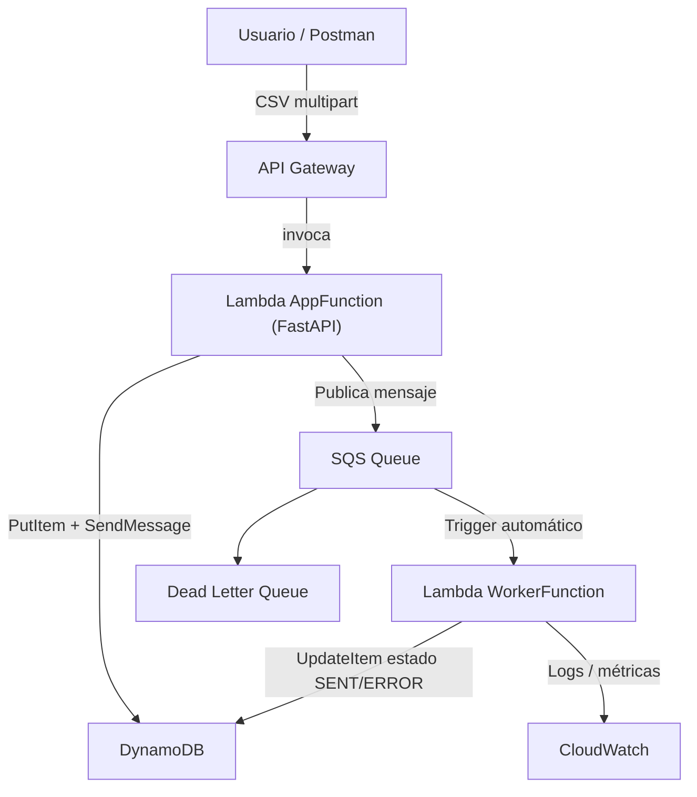
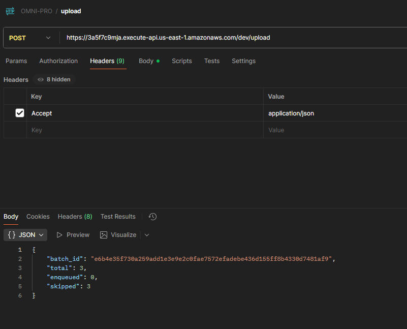
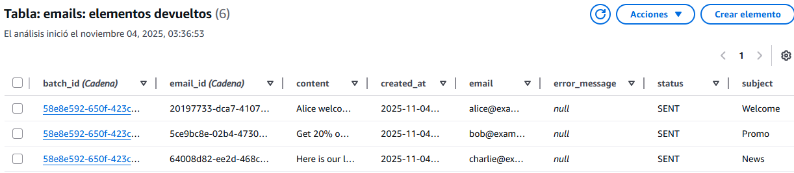
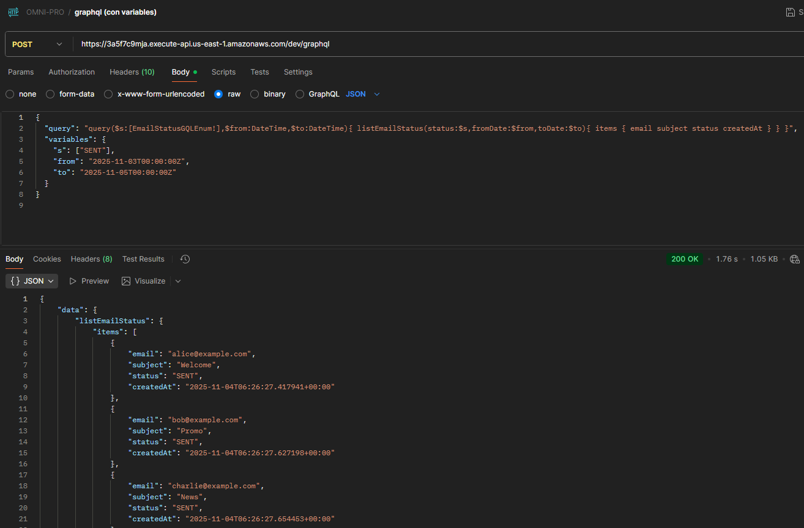
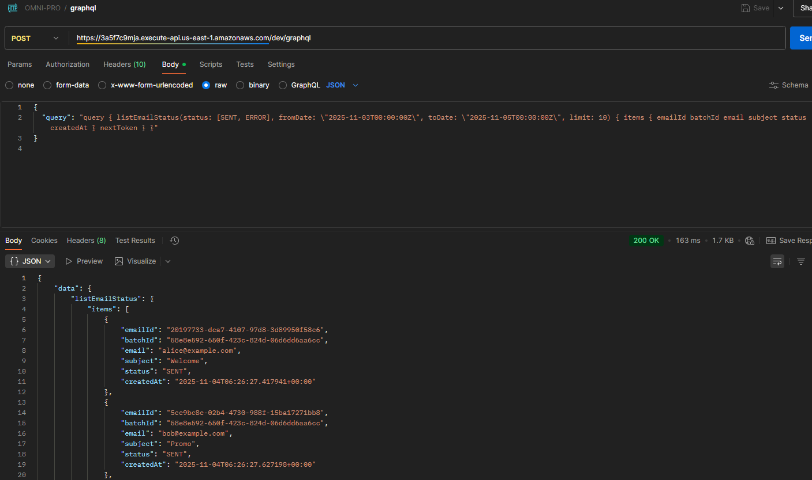
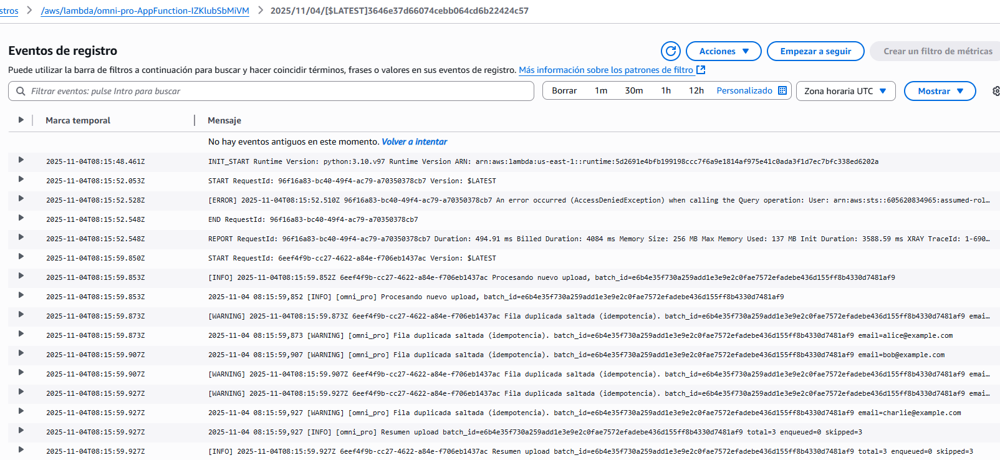
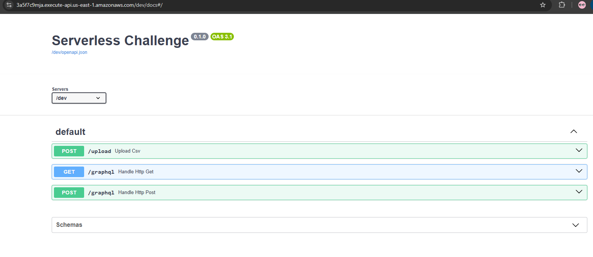

# 🧩 Omni-Pro AWS Challenge — Serverless Email Marketing

## Descripción General
Este proyecto implementa un sistema **serverless en AWS** para procesamiento de correos electrónicos a partir de archivos CSV, cumpliendo con los requerimientos funcionales y no funcionales del reto **Python + AWS (FastAPI + GraphQL + SQS + DynamoDB + SES)**.

---

## 🚀 Arquitectura



---

## ⚙️ Servicios AWS Utilizados

| Servicio | Propósito |
|-----------|------------|
| **API Gateway** | Entrada HTTP pública para `/upload` y `/graphql` |
| **Lambda (AppFunction)** | API FastAPI + Strawberry GraphQL |
| **Lambda (WorkerFunction)** | Procesa mensajes de SQS y simula envío de correos |
| **SQS (email-queue + DLQ)** | Encola mensajes de envío y gestiona reintentos |
| **DynamoDB (emails)** | Almacena estados PENDING / SENT / ERROR |
| **CloudWatch + X-Ray** | Logs, métricas y trazabilidad |

---

## 🧩 Endpoints Principales

### 📤 `POST /upload`
Recibe un archivo CSV (`multipart/form-data`) con columnas:

```
email,subject,content
```

Ejemplo:

```bash
curl -X POST "https://<api-id>.execute-api.us-east-1.amazonaws.com/dev/upload"   -F "file=@emails.csv"
```

**Respuesta:**

```json
{
  "batch_id": "b1f9e7a0-6e9e-47b5-98af-b3b67d7b8479",
  "total": 3,
  "enqueued": 3,
  "skipped": 0
}
```

Ejemplo de prueba en Postman:



Resultado en DynamoDB tras ejecución:



📏 **Tamaño máximo permitido:** 5 MB  
Si el archivo excede el límite, devuelve HTTP 400 con el mensaje:
> "El archivo excede el tamaño máximo permitido de 5 MB."

---

### 🧠 `POST /graphql`
Consulta los estados de envío por estado y rango de fechas.

**Ejemplo:**
```json
{
  "query": "query { listEmailStatus(status: [SENT], fromDate: "2025-11-04T00:00:00Z", toDate: "2025-11-05T00:00:00Z") { items { emailId batchId email subject status createdAt } nextToken } }"
}
```

**Respuesta:**
```json
{
  "data": {
    "listEmailStatus": {
      "items": [
        {
          "emailId": "alice@example.com",
          "batchId": "b1",
          "email": "alice@example.com",
          "subject": "Welcome",
          "status": "SENT",
          "createdAt": "2025-11-04T06:12:04.640Z"
        }
      ],
      "nextToken": null
    }
  }
}
```

📘 **Filtros soportados:**  
- `status`: uno o varios (PENDING, SENT, ERROR)  
- `fromDate` / `toDate`: rango de fechas  
- `limit` / `nextToken`: paginación basada en DynamoDB GSI

Consulta GraphQL con variables (filtrado por estado y rango de fechas):



Consulta GraphQL directa sin variables:



---

## 💾 Requerimientos Funcionales

| Requisito | Estado |
|------------|---------|
| CSV Upload (`multipart/form-data`) | ✅ |
| Pre-signed URL (S3 Trigger) | 🟡 Preparado en infraestructura |
| Límite de tamaño (5 MB) | ✅ Validado y documentado |
| Resumen (`batchId`, `total`, `enqueued`, `skipped`) | ✅ |
| Encolado SQS por email | ✅ |
| Worker + envío simulado | ✅ |
| Persistencia estados | ✅ |
| GraphQL con filtros (status, fechas) | ✅ |
| Librerías FastAPI + Strawberry | ✅ |

---

## 🧠 Requerimientos No Funcionales

| Requisito | Cumplimiento | Descripción |
|------------|---------------|-------------|
| **Infraestructura Serverless** | ✅ | SAM + AWS Lambda + SQS + DynamoDB + API Gateway |
| **Idempotencia** | ✅ | `batch_id` generado por hash SHA256 del CSV |
| **Logs y Métricas** | ✅ | CloudWatch + AWS X-Ray |
| **Errores y Reintentos (DLQ)** | ✅ | `email-dlq` con `maxReceiveCount: 5` |
| **Seguridad IAM Roles mínimos** | ✅ | Roles separados App/Worker con principio de menor privilegio |
| **Costo optimizado** | ✅ | 100% serverless (on-demand, < $1/mes en baja carga) |

---

## 🧪 Pruebas Unitarias

Las pruebas están implementadas con `pytest` y `moto`, validando:

- Encolado y parseo correcto del CSV
- Idempotencia de carga
- Paginación en DynamoDB
- Filtros por estado y rango de fechas

```bash
python -m pytest -q
```
✔ Todos los tests pasan exitosamente.

---

## 🧰 Despliegue (AWS SAM)

```bash
sam build
sam deploy --guided
```

Salidas principales (`Outputs`):

| Key | Descripción |
|-----|--------------|
| `ApiUrl` | URL base para la API FastAPI + GraphQL |
| `EmailsTableName` | Tabla DynamoDB principal |
| `EmailQueueUrl` | URL de la cola SQS |
| `CsvBucketName` | Bucket S3 para CSV (opcional) |

---

## 📊 Logs y Métricas

- **CloudWatch Logs**: registro por Lambda.  
- **AWS X-Ray**: tracing distribuido habilitado.  
- **DLQ (email-dlq)**: monitorea fallos definitivos.

Ejecución del worker procesando la cola de SQS, validando idempotencia y actualizaciones de estado en DynamoDB:



---

## 📜 Swagger Docs
La API documentada automáticamente con **FastAPI** y disponible en:

```
https://3a5f7c9mja.execute-api.us-east-1.amazonaws.com/dev/docs
```



---

## 🔒 Seguridad

- IAM Roles separados con permisos mínimos.  
- Ninguna credencial hardcodeada.  
- Secrets gestionables vía **AWS Secrets Manager** o **SSM Parameter Store**.  

---

## 💡 Mejoras Futuras

- [ ] Activar flujo alternativo con carga vía **pre-signed URL (S3 Trigger)**  
- [ ] Integrar **Amazon SES real** en lugar de simulador  
- [ ] Añadir métricas personalizadas (enviados/minuto, tasa de error)  
- [ ] CI/CD con **GitHub Actions** para despliegue automatizado  

---

## 🧾 Autor

**Brahyan Bedoya Gómez**  
💻 Backend Engineer | AWS | Python | FastAPI | Serverless  
📧 [brahyan.bedoya@hotmail.es](mailto:brahyan.bedoya@hotmail.es)

---
